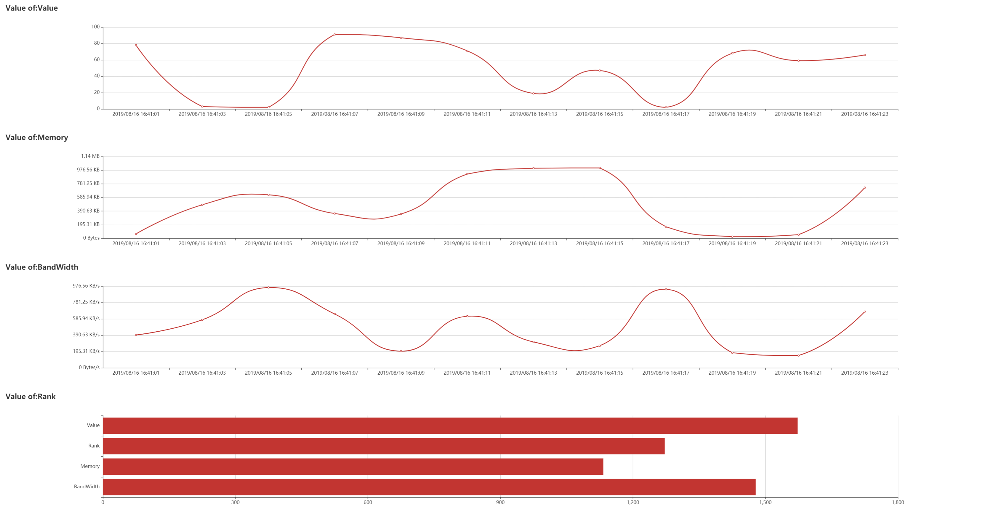

# go-dataviewer
Visualize your data in browser.

## install
```
go get github.com/LiMoMoMo/go-dataviewer
```

## steps
1. embed `viewer` to your struct.
```go
import (
	viewer "github.com/LiMoMoMo/go-dataviewer"
)

type Demo struct {
	viewer.Viewer
}
```

2. implement `GetVal(name string)`
```
func (b *Demo) GetVal(name string) interface{} {
	val, ok := tempMap[name]
	if !ok {
		tempMap[name] = 0
	}
	tempMap[name] = val + rand.Intn(100)
	switch name {
	case "Value":
		return int64(rand.Intn(100))
	case "Memory":
		return int64(rand.Intn(1024 * 1024))
	case "BandWidth":
		return int64(rand.Intn(1024 * 1024))
	case "Rank":
		return tempMap
	}
	return ""
}
```

3. register your data's `name` and `type`
```
demo.Register("Value", viewer.TypeValue)
demo.Register("Memory", viewer.TypeMemory)
demo.Register("BandWidth", viewer.TypeBandWidth)
demo.Register("Rank", viewer.TypeRank)
```

4. start `Run`
```
demo := Demo{}
demo.SetChild(&demo, ctx)
...
demo.SetHttp("0.0.0.0:8946", 1)
demo.Run()
```

5. visit `http://127.0.0.1:8946/view` in your browser, you will see somethings like this:


